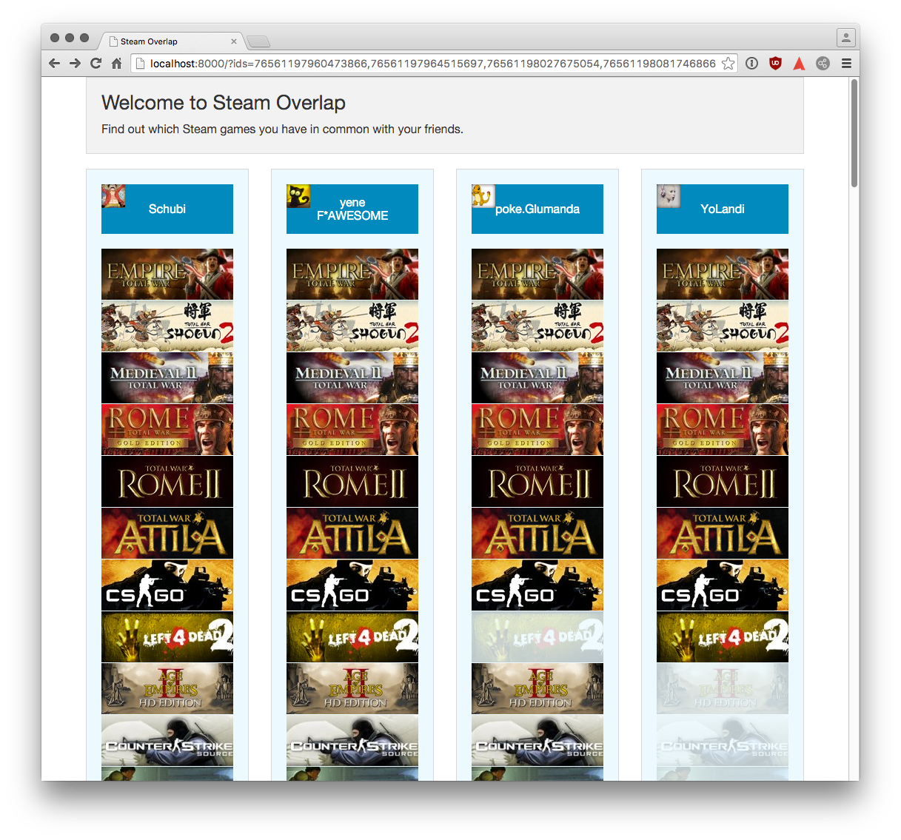

# Steam Overlap
Show what steam games you have in common with your friends.

# Setup
* It requires PHP 5.6

# Todo
* blacklist http://store.steampowered.com/app/397080/
* kick out foundation for another stylekit and custom layout
* add filter for singleplayer in UI
* add filter for free games in UI
* add spinner for ajax request
* when profile is private show warning (like 76561197974899907)
* sort games by total playtime (of all players)
* sort games alphabetically
* fix cron that deletes old files
* add UI to filter for minimum playtime
* better error dialog

# Private profiles
Profiles with communityvisibilitystate=1 are not used.

# Bigger Todos
* dynamically add columns
* sort games by rating

# Notes
* http://steamidfinder.com/
* http://stackoverflow.com/questions/19247887/get-steamid-by-user-nickname
* image format: http://media.steampowered.com/steamcommunity/public/images/apps/{appid}/{hash}.jpg

# steam api
* API DOC: https://developer.valvesoftware.com/wiki/Steam_Web_API
* All games: http://api.steampowered.com/ISteamApps/GetAppList/v0001/
